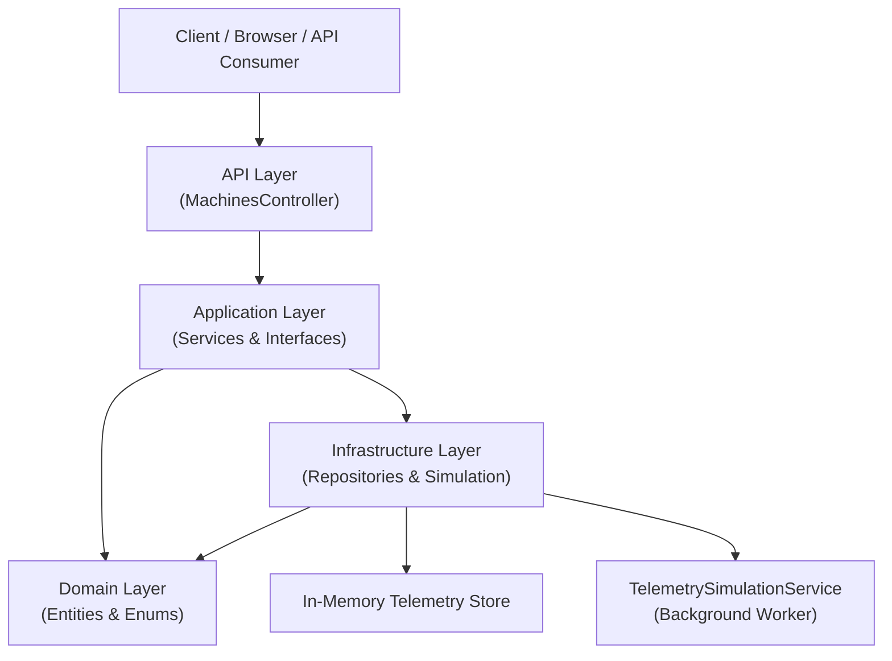

# 🏭 Cloud Manufacturing Monitoring System

A clean‑architecture based **ASP.NET Core Web API** that simulates manufacturing machine telemetry, stores events in memory, computes machine uptime/downtime metrics, and exposes insights via REST APIs.

---

## 📌 Key Features

- ✅ Real‑time telemetry simulation
- ✅ Machine uptime & downtime calculation
- ✅ Status timeline generation
- ✅ Clean Architecture (API, Application, Domain, Infrastructure)
- ✅ In‑memory repository for fast testing
- ✅ Fully unit‑tested business logic
- ✅ Swagger / OpenAPI support

---

## 🧱 Solution Architecture

The solution follows **Clean Architecture**, ensuring separation of concerns, testability, and scalability.

### 🔷 Layer Responsibilities

| Layer | Responsibility |
|-----|---------------|
| **API** | HTTP endpoints, DTO mapping, request validation |
| **Application** | Business logic, use cases, interfaces |
| **Domain** | Core entities, enums, business rules |
| **Infrastructure** | Data storage, simulations, background services |
| **Tests** | Unit tests with fake repositories |

---

## 🧩 Architecture Diagram

---

##  📡 API Endpoints

### 🔷 Get Current Machine Status

GET /api/machines/{machineId}/status

### 🔷 Get Telemetry Events

GET /api/machines/{machineId}/telemetry?fromUtc=...&toUtc=...

### 🔷 Get Machine Metrics

GET /api/machines/{machineId}/metrics?windowMinutes=60

### 🔷 Get Status Timeline

GET /api/machines/{machineId}/timeline?fromUtc=...&toUtc=...

### 🧠 Business Logic Overview
✅ Machine Metrics
- Calculates uptime and downtime over a rolling window
- Computes current downtime streak
- Handles real‑time ongoing states
  
✅ Machine History
- Converts raw telemetry into readable timelines
- Groups status intervals by time range
🗃 Infrastructure Layer

✅ InMemoryTelemetryRepository
- Thread‑safe in‑memory telemetry storage
- Optimized for development and testing

✅ TelemetrySimulationService
- Background worker using BackgroundService
- Simulates real‑world machine behavior
Emits random status transitions

🧪 Testing Strategy
- Uses FakeTelemetryRepository
- Tests application services in isolation
- No API or infrastructure dependency

